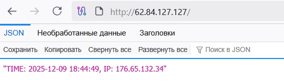

## Описание проекта

Это простое веб-приложение на FastAPI, предназначенное для изучения контейнеризации и работы с Docker Compose. Приложение демонстрирует:

- Создание веб-сервиса на FastAPI
- Подключение к базе данных MySQL
- Работу с прокси-серверами (Nginx → HAProxy → FastAPI)
- Корректную настройку сетей Docker
- Передачу IP-адресов через заголовки прокси

## Запуск
```terraform apply```

## Результат выполнения
```curl <ip адрес>:80```


Проект включает в себя:
- создание VPC и VM
- создание группы безопасности и привязку к VM
- создание БД MySQL
- сборку приложения в виде docker-образа
- запуск через docker compose

## Requirements

| Name | Version |
|------|---------|
| <a name="requirement_terraform"></a> [terraform](#requirement\_terraform) | =1.14.0 |
| <a name="requirement_local"></a> [local](#requirement\_local) | = 2.6.1 |
| <a name="requirement_null"></a> [null](#requirement\_null) | = 3.2.4 |
| <a name="requirement_random"></a> [random](#requirement\_random) | = 3.7.2 |
| <a name="requirement_template"></a> [template](#requirement\_template) | = 2.2.0 |
| <a name="requirement_yandex"></a> [yandex](#requirement\_yandex) | = 0.174 |

## Providers

| Name | Version |
|------|---------|
| <a name="provider_local"></a> [local](#provider\_local) | 2.6.1 |
| <a name="provider_null"></a> [null](#provider\_null) | 3.2.4 |
| <a name="provider_template"></a> [template](#provider\_template) | 2.2.0 |
| <a name="provider_yandex"></a> [yandex](#provider\_yandex) | 0.174.0 |

## Modules

| Name | Source | Version |
|------|--------|---------|
| <a name="module_mysql_cluster"></a> [mysql\_cluster](#module\_mysql\_cluster) | ./mysql | n/a |
| <a name="module_mysql_db_user"></a> [mysql\_db\_user](#module\_mysql\_db\_user) | ./mysql_db_user | n/a |
| <a name="module_vpc_dev"></a> [vpc\_dev](#module\_vpc\_dev) | ./vpc | n/a |

## Resources

| Name | Type |
|------|------|
| [local_file.build_app_script](https://registry.terraform.io/providers/hashicorp/local/2.6.1/docs/resources/file) | resource |
| [local_file.compose](https://registry.terraform.io/providers/hashicorp/local/2.6.1/docs/resources/file) | resource |
| [local_file.hosts_for](https://registry.terraform.io/providers/hashicorp/local/2.6.1/docs/resources/file) | resource |
| [null_resource.run_docker_compose](https://registry.terraform.io/providers/hashicorp/null/3.2.4/docs/resources/resource) | resource |
| [yandex_compute_instance.web](https://registry.terraform.io/providers/yandex-cloud/yandex/0.174/docs/resources/compute_instance) | resource |
| [yandex_container_registry.my-reg](https://registry.terraform.io/providers/yandex-cloud/yandex/0.174/docs/resources/container_registry) | resource |
| [yandex_lockbox_secret.db_password](https://registry.terraform.io/providers/yandex-cloud/yandex/0.174/docs/resources/lockbox_secret) | resource |
| [yandex_lockbox_secret_version.db_password_version](https://registry.terraform.io/providers/yandex-cloud/yandex/0.174/docs/resources/lockbox_secret_version) | resource |
| [yandex_vpc_security_group.my_sg](https://registry.terraform.io/providers/yandex-cloud/yandex/0.174/docs/resources/vpc_security_group) | resource |
| [template_file.cloudinit](https://registry.terraform.io/providers/hashicorp/template/2.2.0/docs/data-sources/file) | data source |
| [yandex_compute_image.my_image_family](https://registry.terraform.io/providers/yandex-cloud/yandex/0.174/docs/data-sources/compute_image) | data source |
| [yandex_lockbox_secret_version.db_password](https://registry.terraform.io/providers/yandex-cloud/yandex/0.174/docs/data-sources/lockbox_secret_version) | data source |
| [yandex_vpc_security_group.my_sg](https://registry.terraform.io/providers/yandex-cloud/yandex/0.174/docs/data-sources/vpc_security_group) | data source |

## Inputs

| Name | Description | Type | Default | Required |
|------|-------------|------|---------|:--------:|
| <a name="input_cloud_id"></a> [cloud\_id](#input\_cloud\_id) | https://cloud.yandex.ru/docs/resource-manager/operations/cloud/get-id | `string` | n/a | yes |
| <a name="input_db_cluster_name"></a> [db\_cluster\_name](#input\_db\_cluster\_name) | n/a | `string` | `"my_cluster"` | no |
| <a name="input_db_name"></a> [db\_name](#input\_db\_name) | n/a | `string` | `"virtd"` | no |
| <a name="input_db_user"></a> [db\_user](#input\_db\_user) | n/a | `string` | `"app"` | no |
| <a name="input_default_cidr"></a> [default\_cidr](#input\_default\_cidr) | https://cloud.yandex.ru/docs/vpc/operations/subnet-create | `string` | `"10.0.3.0/24"` | no |
| <a name="input_default_zone"></a> [default\_zone](#input\_default\_zone) | https://cloud.yandex.ru/docs/overview/concepts/geo-scope | `string` | `"ru-central1-a"` | no |
| <a name="input_folder_id"></a> [folder\_id](#input\_folder\_id) | https://cloud.yandex.ru/docs/resource-manager/operations/folder/get-id | `string` | n/a | yes |
| <a name="input_image_family"></a> [image\_family](#input\_image\_family) | n/a | `string` | `"ubuntu-2404-lts"` | no |
| <a name="input_instance_count"></a> [instance\_count](#input\_instance\_count) | n/a | `number` | `1` | no |
| <a name="input_platform_id"></a> [platform\_id](#input\_platform\_id) | n/a | `string` | `"standard-v3"` | no |
| <a name="input_public_ip"></a> [public\_ip](#input\_public\_ip) | n/a | `bool` | `true` | no |
| <a name="input_security_group_egress"></a> [security\_group\_egress](#input\_security\_group\_egress) | secrules egress | <pre>list(object(<br>    {<br>      protocol       = string<br>      description    = string<br>      v4_cidr_blocks = list(string)<br>      port           = optional(number)<br>      from_port      = optional(number)<br>      to_port        = optional(number)<br>  }))</pre> | <pre>[<br>  {<br>    "description": "разрешить весь исходящий трафик",<br>    "from_port": 0,<br>    "protocol": "TCP",<br>    "to_port": 65365,<br>    "v4_cidr_blocks": [<br>      "0.0.0.0/0"<br>    ]<br>  }<br>]</pre> | no |
| <a name="input_security_group_ingress"></a> [security\_group\_ingress](#input\_security\_group\_ingress) | secrules ingress | <pre>list(object(<br>    {<br>      protocol       = string<br>      description    = string<br>      v4_cidr_blocks = list(string)<br>      port           = optional(number)<br>      from_port      = optional(number)<br>      to_port        = optional(number)<br>  }))</pre> | <pre>[<br>  {<br>    "description": "разрешить входящий ssh",<br>    "port": 22,<br>    "protocol": "TCP",<br>    "v4_cidr_blocks": [<br>      "0.0.0.0/0"<br>    ]<br>  },<br>  {<br>    "description": "разрешить входящий  http",<br>    "port": 80,<br>    "protocol": "TCP",<br>    "v4_cidr_blocks": [<br>      "0.0.0.0/0"<br>    ]<br>  },<br>  {<br>    "description": "разрешить входящий https",<br>    "port": 443,<br>    "protocol": "TCP",<br>    "v4_cidr_blocks": [<br>      "0.0.0.0/0"<br>    ]<br>  }<br>]</pre> | no |
| <a name="input_token"></a> [token](#input\_token) | OAuth-token; https://cloud.yandex.ru/docs/iam/concepts/authorization/oauth-token | `string` | n/a | yes |
| <a name="input_vm_core_fraction"></a> [vm\_core\_fraction](#input\_vm\_core\_fraction) | n/a | `number` | `20` | no |
| <a name="input_vm_cpu"></a> [vm\_cpu](#input\_vm\_cpu) | n/a | `number` | `2` | no |
| <a name="input_vm_ram"></a> [vm\_ram](#input\_vm\_ram) | n/a | `number` | `4` | no |
| <a name="input_vms_ssh_root_key"></a> [vms\_ssh\_root\_key](#input\_vms\_ssh\_root\_key) | ssh-keygen -t ed25519 | `string` | `"your_ssh_ed25519_key"` | no |
| <a name="input_vpc_name"></a> [vpc\_name](#input\_vpc\_name) | VPC network&subnet name | `string` | `"develop"` | no |

## Outputs

No outputs.
